# Constraints

Auto Layout convenience with minimal API surface area, but high expressive power

## Features

- [x] Minimal API accessible through `constrain` proxy
- [x] Direct access to created `NSLayoutConstraint`
- [x] `UILayoutGuide` support
- [x] New constant `UILayoutPriority.maxNonRequired` (999) for resolving layout ambiguities

## Usage

### Edges


```swift
subview.constrain.edges(to: view)
```

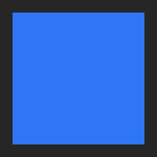

```swift
subview.constrain.edges(to: view.readableContentGuide)
```

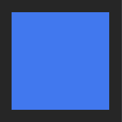

```swift
subview.constrain.edges(to: view, insets: .uniform(10))
```

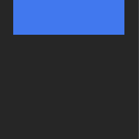

```swift
subview.constrain.edges(.all(except: .bottom), to: view, insets: .horizontal(10))
```

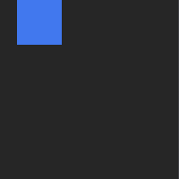

```swift
subview.constrain.edges([.top, .leading], to: view, insets: .leading(10))
```

### Edge

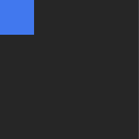

```swift
subview.constrain.edge(.leading, to: view)
```

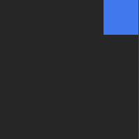

```swift
subview.constrain.edge(.trailing, to: view, edge: .trailing)
```

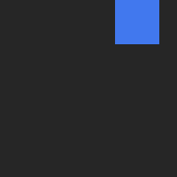

```swift
subview.constrain.edge(.trailing, to: view, edge: .trailing, constant: -10, relation: .greaterThanOrEqual)
```

### Size

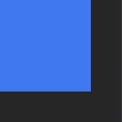

```swift
subview.constrain.size(CGSize(width: 75, height: 75))
```


```swift
subview.constrain.size(to: view)
```


```swift
subview.constrain.size(to: view, multiplier: 0.5)
```

### Dimension


```swift
subview.constrain.dimension(.width, to: view)
```

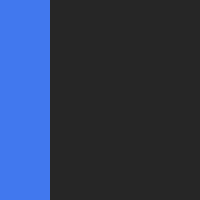

```swift
subview.constrain.dimension(.height, to: view, dimension: .width)
```

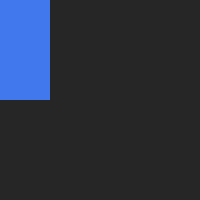

```swift
subview.constrain.dimension(.height, to: view, dimension: .width, multiplier: 0.5)
```

### Center


```swift
subview.constrain.center(to: view)
```

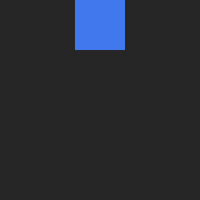

```swift
subview.constrain.center(.horizontal, to: view)
```


```swift
subview.constrain.center(.vertical, to: view, constant: 10)
```

## Installation

### Requirements
- iOS 11.0+
- Swift 4.2+

### Carthage
```
github "vadimtrifonov/Constraints"
```
