# Constraint Proxy

Auto Layout convenience with minimal API surface area, but high expressive power

## Features

- [x] Minimal API accessible through `constraint` proxy
- [x] Direct access to created `NSLayoutConstraint`
- [x] `UILayoutGuide` support
- [x] New `UILayoutPriority` constants including `.maxNonRequired` (999) for resolving layout ambiguities
- [x] `translatesAutoresizingMaskIntoConstraints` is automatically set to `false` on a target

## Usage

### Edges


```swift
subview.constraint.edges(to: view)
```


```swift
subview.constraint.edges(to: view, insets: .uniform(10))
```

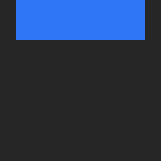

```swift
subview.constraint.edges(excluding: .bottom, to: view, insets: .horizontal(10))
```

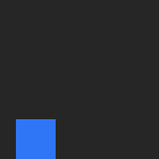

```swift
subview.constraint.edges(.bottom, .leading, to: view, insets: .leading(10))
```

### Horizontal axis

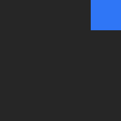

```swift
subview.constraint.trailing(to: view)
```


```swift
subview.constraint.centerX(to: view)
```

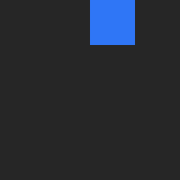

```swift
subview.constraint.leading(to: view, .centerX)
```

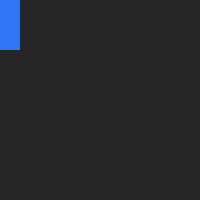

```swift
subview.constraint.trailing(to: view, .leading, constant: 10)
```

### Vertical axis

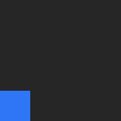

```swift
subview.constraint.bottom(to: view)
```

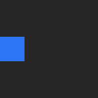

```swift
subview.constraint.centerY(to: view)
```

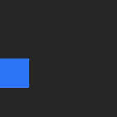

```swift
subview.constraint.top(to: view, .centerY)
```

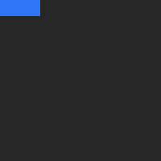

```swift
subview.constraint.bottom(to: view, .top, constant: 10)
```


```swift
subview.constraint.lastBaseline(to: view)
```

### Center

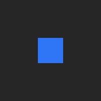


```swift
subview.constraint.center(to: view)
```

### Size

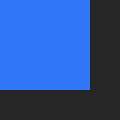

```swift
subview.constraint.size(CGSize(width: 75, height: 75))
```


```swift
subview.constraint.size(to: view)
```

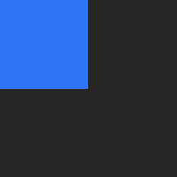

```swift
subview.constraint.size(to: view, multiplier: 0.5)
```

### Dimension

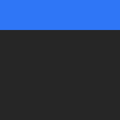

```swift
subview.constraint.width(to: view)
```


```swift
subview.constraint.height(to: view, .width)
```

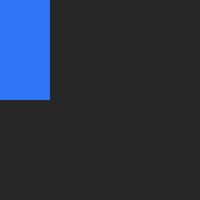

```swift
subview.constraint.height(to: view, multiplier: 0.5)
```

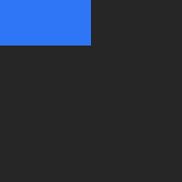

```swift
subview.constraint.width(constant: 50)
```

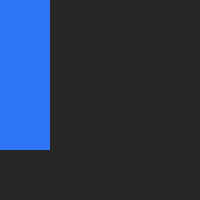

```swift
subview.constraint.height(constant: 75)
```

### Layout guide

`UIView` and `UILayoutGuide` can be used interchangeably.

```swift
subview.constraint.edges(to: view.layoutMarginsGuide)
```

```swift
subview.constraint.lastBaseline(to: view.safeAreaLayoutGuide, .bottom)
```

```swift
subview.constraint.width(to: view.readableContentGuide)
```

### Relation

Allmost all constraint methods have `relation` parameter.

```swift
subview.constraint.leading(to: view, relation: .greaterThanOrEqual)
```

### Priority

All constraint methods have `priority` parameter.

```swift
subview.constraint.leading(to: view, priority: .defaultLow)
```

### Activation

Constraints are created active by default. All constraint methods have `active` parameter to opt out of this.

```swift
subview.constraint.leading(to: view, active: false)
```

## Installation

### Requirements
- iOS 11.0+
- Swift 5.0+

### Carthage
```
github "vadimtrifonov/ConstraintProxy"
```
